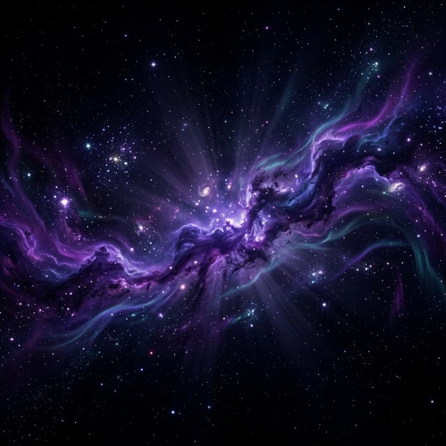

# AuraForm 🌌

**AuraForm** is a premium, AI-powered form builder designed with a stunning galaxy-themed dark aesthetic. Build, publish, and analyze beautiful forms with ease and speed.



## ✨ Features

- **🎨 Premium Dark Theme:** A cohesive, high-end "Aura" aesthetic with glassmorphism, purple gradients, and AI-generated cosmic backgrounds.
- **⚡ AI-Powered Generation:** Leverage AI to create complex form structures in seconds (Coming Soon / Backend Integrated).
- **📝 Single-Page Form View:** A modern, scrollable form-filling experience for respondents—no more step-by-step friction.
- **📊 Live Analytics:** Real-time data visualization with sleek, dark-themed charts to track responses and ratings.
- **🛠️ Drag & Drop Builder:** A functional sidebar with various element types (Short Text, Rating, Multiple Choice, Email, etc.).
- **🔐 Secure & Robust:** Built with Next.js 15, NextAuth.js, and Prisma ORM with Neon PostgreSQL.

## 🚀 Tech Stack

- **Framework:** [Next.js 15](https://nextjs.org/)
- **Styling:** [Tailwind CSS](https://tailwindcss.com/)
- **Database:** [PostgreSQL (Neon)](https://neon.tech/)
- **ORM:** [Prisma](https://www.prisma.io/)
- **Auth:** [NextAuth.js](https://next-auth.js.org/)
- **State Management:** [Zustand](https://github.com/pmndrs/zustand)
- **Animations:** [Framer Motion](https://www.framer.com/motion/)
- **Icons:** [Lucide React](https://lucide.dev/)

## 🛠️ Getting Started

### 1. Clone the repository
```bash
git clone https://github.com/Shivam01729/Auraform.git
cd Auraform
```

### 2. Install dependencies
```bash
npm install
```

### 3. Set up environment variables
Create a `.env` file in the root directory:
```env
DATABASE_URL="your_neon_postgresql_url"
DIRECT_URL="your_neon_direct_url"
NEXTAUTH_SECRET="your_nextauth_secret"
NEXTAUTH_URL="http://localhost:3000"
```

### 4. Push the database schema
```bash
npx prisma db push
```

### 5. Run the development server
```bash
npm run dev
```

Open [http://localhost:3000](http://localhost:3000) with your browser to see the result.

## 📸 Screenshots

### The Builder


### The Dashboard
Custom glassmorphism cards and smooth transitions.

---

Built with 💜 by [Shivam](https://github.com/Shivam01729)
